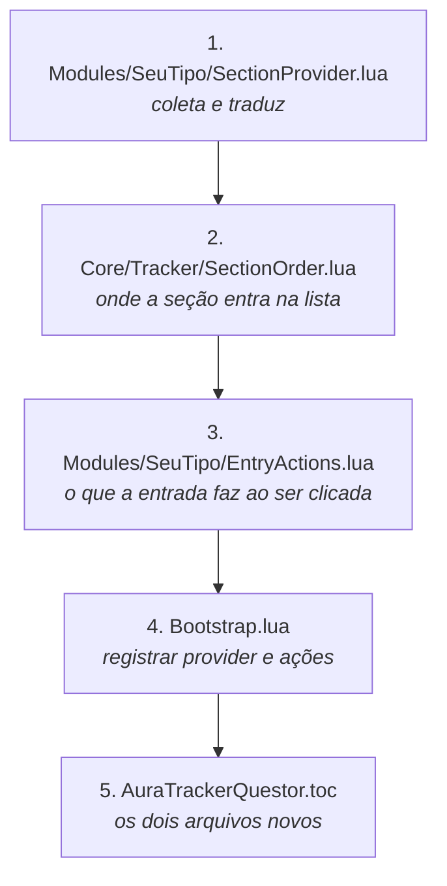

# Adicionar um tipo de conteúdo

É a mudança mais comum no projeto, e foi desenhada para caber em uma pasta nova
mais uma linha. Nada que já funciona é editado.

## Os cinco passos



## 1. O provider

Implementa uma porta de um método só,
[`SectionProvider`](../Ports/SectionProvider.lua). O trabalho é ler o jogo e
devolver a estrutura comum.

```lua
local _, Addon = ...

local ENTRY_KIND = "seuTipo"

---@class SeuTipoSectionProvider : SectionProvider
local SeuTipoSectionProvider = {}
SeuTipoSectionProvider.__index = SeuTipoSectionProvider

---@return SeuTipoSectionProvider
function SeuTipoSectionProvider.New()
	return setmetatable({}, SeuTipoSectionProvider)
end

---@return TrackerSection[]
function SeuTipoSectionProvider:Collect()
	local entries = {}

	for _, id in ipairs(C_SuaApi.GetTrackedThings() or {}) do
		local info = C_SuaApi.GetInfo(id)

		-- Dado que o jogo ainda não carregou chega como nil. Pular é melhor que
		-- desenhar uma linha em branco.
		if info and info.name then
			table.insert(entries, {
				id = id,
				kind = ENTRY_KIND,
				title = info.name,
				objectives = {},
				isComplete = info.completed == true,
				canFindGroup = false,
			})
		end
	end

	return {
		{
			id = "seuTipo",
			title = SEU_GLOBAL_DA_BLIZZARD,
			order = Addon.SectionOrder.seuTipo,
			entries = entries,
		},
	}
end

Addon.SeuTipoSectionProvider = SeuTipoSectionProvider
```

Três coisas que valem seguir:

**O título vem de uma global da Blizzard** quando existir uma
(`TRACKER_HEADER_QUESTS`, `ADVENTURE_TRACKING_MODULE_HEADER_TEXT`). Chega
traduzido de graça, em todos os idiomas.

**`Collect` devolve uma lista**, não uma seção. Uma fonte pode alimentar mais de
uma: o provider de missões devolve campanha e missões separadas.

**Seção vazia não precisa de guarda.** O `TrackerContent` descarta as sem
entradas antes de ordenar.

Se a sua API publica uma lista de ids mais uma consulta por id, e descreve
progresso como `requirementsList`, não escreva um provider:
[`TrackedListSectionProvider`](../Modules/TrackedListSectionProvider.lua) já faz
isso e só precisa de uma tabela de configuração. Atividades Mensais e Tarefas de
Iniciativa usam o mesmo.

## 2. A ordem da seção

Uma linha em [`Core/Tracker/SectionOrder.lua`](../Core/Tracker/SectionOrder.lua).
O `id` da seção é a chave, e a ordem inteira do rastreador se lê ali.

```lua
seuTipo = 45,
```

Há um teste que falha se duas seções empatarem no mesmo número.

## 3. As ações

Só se a entrada precisar responder ao clique. A porta é
[`EntryActions`](../Ports/EntryActions.lua), e os métodos são **opcionais**: o
roteador verifica capacidade antes de chamar, então implemente apenas o que faz
sentido.

| Método | Quando |
|---|---|
| `OpenDetails` | clique esquerdo no bloco |
| `MenuItems` | clique direito; lista vazia significa nenhum menu |
| `SuperTrack` | clique no pino |
| `Untrack` | item do menu |
| `Describe` | texto do tooltip |
| `Rewards` | recompensas no tooltip |
| `FindGroup` | o olho verde de conteúdo em grupo |

Um cenário não abre página nem pode ser desrastreado, então
[`Modules/Scenario/EntryActions.lua`](../Modules/Scenario/EntryActions.lua) é
quase vazio de propósito.

## 4. Registrar

Duas linhas no [`Bootstrap.lua`](../Bootstrap.lua), que é o único lugar do
projeto autorizado a conhecer implementações concretas:

```lua
-- na lista de providers do TrackerContent
Addon.SeuTipoSectionProvider.New(),

-- na tabela do EntryActionRouter, chaveada pelo kind da entrada
seuTipo = Addon.SeuTipoEntryActions.New(),
```

O `kind` da entrada é o que liga uma à outra. Dois kinds podem dividir o mesmo
objeto de ações: `quest` e `worldQuest` apontam para a mesma instância, porque
missão mundial é missão e responde às mesmas chamadas.

## 5. O `.toc`

Os dois arquivos novos, na seção `Modules`. O `build.ps1` confere nos dois
sentidos e falha se você esquecer — arquivo listado que não foi empacotado, e
arquivo empacotado que não está listado.

## Se precisar de evento novo

Se o seu tipo muda por um evento que ainda não é escutado, some à lista de
[`System/TrackerEvents.lua`](../System/TrackerEvents.lua). Ele já faz o debounce;
não crie outro frame de eventos.

## Conferir

```sh
lua Tests/Run.lua
.\build.ps1
```

E em jogo: rastreie algo do tipo novo e confirme que a seção aparece na posição
que você declarou, com a contagem certa no cabeçalho.
