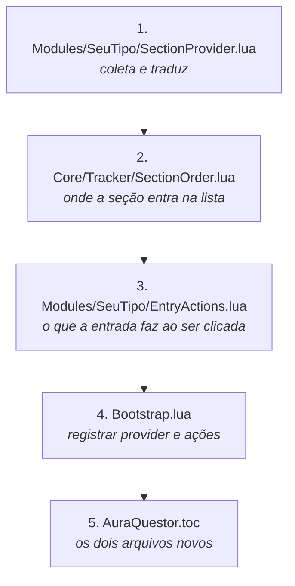

# Adicionar um tipo de conteúdo

É a extensão mais comum do projeto. Requer uma pasta nova e o registro no
composition root; nenhum código existente é alterado.

## Os cinco passos



## 1. O provider

Implementa a porta [`SectionProvider`](../Source/Ports/SectionProvider.lua), que tem um
método. A responsabilidade é ler a API do jogo e devolver a estrutura comum.

```lua
local _, Addon = ...

local ENTRY_KIND = "seuTipo"

---@class SeuTipoSectionProvider : SectionProvider
local SeuTipoSectionProvider = {}
SeuTipoSectionProvider.__index = SeuTipoSectionProvider

---@return SeuTipoSectionProvider
function SeuTipoSectionProvider.New()
	return setmetatable({}, SeuTipoSectionProvider)
end

---@return TrackerSection[]
function SeuTipoSectionProvider:Collect()
	local entries = {}

	for _, id in ipairs(C_SuaApi.GetTrackedThings() or {}) do
		local info = C_SuaApi.GetInfo(id)

		-- Dado que o jogo ainda não carregou chega como nil. Pular é melhor que
		-- desenhar uma linha em branco.
		if info and info.name then
			table.insert(entries, {
				id = id,
				kind = ENTRY_KIND,
				title = info.name,
				objectives = {},
				isComplete = info.completed == true,
				canFindGroup = false,
			})
		end
	end

	return {
		{
			id = "seuTipo",
			title = SEU_GLOBAL_DA_BLIZZARD,
			order = Addon.SectionOrder.seuTipo,
			entries = entries,
		},
	}
end

Addon.SeuTipoSectionProvider = SeuTipoSectionProvider
```

Três convenções a seguir:

**Use a global da Blizzard como título** quando existir uma
(`TRACKER_HEADER_QUESTS`, `ADVENTURE_TRACKING_MODULE_HEADER_TEXT`). Ela já vem
traduzida em todos os idiomas do cliente.

**`Collect` devolve uma lista**, não uma seção. Uma mesma fonte pode alimentar
mais de uma: o provider de missões devolve campanha e missões em seções
separadas.

**Não é preciso tratar seção vazia.** O `TrackerContent` descarta as seções sem
entradas antes de ordenar.

Se a API expõe uma lista de ids mais uma consulta por id, e descreve progresso
como `requirementsList`, use
[`TrackedListSectionProvider`](../Source/Modules/TrackedListSectionProvider.lua) em vez
de escrever um provider. Ele recebe uma tabela de configuração. Atividades
Mensais e Tarefas de Iniciativa compartilham essa implementação.

## 2. A ordem da seção

Uma linha em [`Core/Tracker/SectionOrder.lua`](../Source/Core/Tracker/SectionOrder.lua),
onde o `id` da seção é a chave. O arquivo concentra a ordem de todas as seções.

```lua
seuTipo = 45,
```

Há um teste que falha se duas seções receberem o mesmo número.

## 3. As ações

Necessário apenas se a entrada responder ao clique. A porta é
[`EntryActions`](../Source/Ports/EntryActions.lua) e seus métodos são **opcionais**: o
roteador verifica a presença de cada um antes de chamar, então implemente somente
os que se aplicam.

| Método | Quando |
|---|---|
| `OpenDetails` | clique esquerdo no bloco |
| `MenuItems` | clique direito; lista vazia significa nenhum menu |
| `SuperTrack` | clique no pino |
| `Untrack` | item do menu |
| `Describe` | texto do tooltip |
| `Rewards` | recompensas no tooltip |
| `FindGroup` | o olho verde de conteúdo em grupo |

Um cenário não tem página para abrir nem pode ser desrastreado, e por isso
[`Modules/Scenario/EntryActions.lua`](../Source/Modules/Scenario/EntryActions.lua)
implementa quase nada.

## 4. Registrar

Duas linhas no [`Bootstrap.lua`](../Source/Bootstrap.lua), único arquivo do projeto que
conhece implementações concretas:

```lua
-- na lista de providers do TrackerContent
Addon.SeuTipoSectionProvider.New(),

-- na tabela do EntryActionRouter, chaveada pelo kind da entrada
seuTipo = Addon.SeuTipoEntryActions.New(),
```

O campo `kind` da entrada é o que associa as duas. Dois kinds podem compartilhar
o mesmo objeto de ações: `quest` e `worldQuest` apontam para a mesma instância,
porque uma missão mundial responde às mesmas chamadas de uma missão comum.

## 5. O `.toc`

Registre os dois arquivos novos na seção `Modules`. O `build.ps1` valida nos dois
sentidos e falha em caso de omissão: arquivo listado que não foi empacotado, e
arquivo empacotado que não consta na lista.

## Eventos adicionais

Se o tipo novo depende de um evento ainda não registrado, acrescente-o à lista em
[`System/TrackerEvents.lua`](../Source/System/TrackerEvents.lua). O agrupamento já está
implementado ali; não crie outro frame de eventos.

## Verificar

```sh
lua Tests/Run.lua
.\build.ps1
```

No cliente, rastreie um item do tipo novo e confirme que a seção aparece na
posição declarada, com a contagem correta no cabeçalho.
