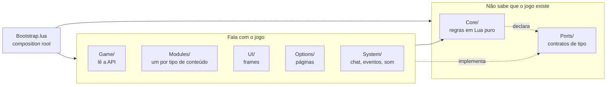
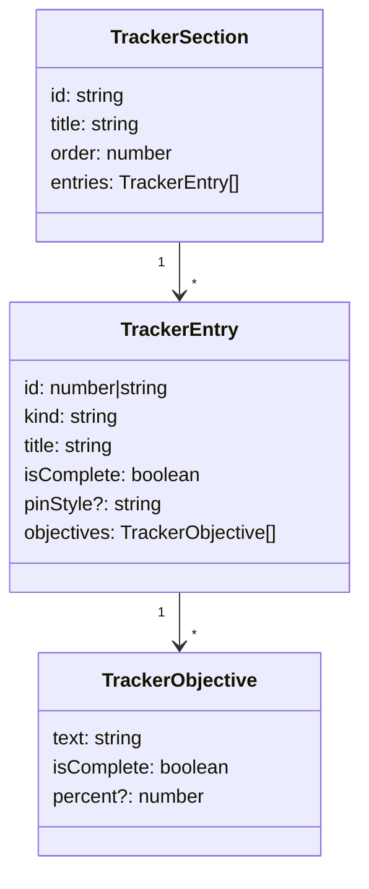

# Arquitetura

## A regra

Uma só, e todo o resto sai dela: **a dependência aponta para dentro**. O `Core/`
não conhece ninguém; quem fala com o jogo conhece o `Core/`.



O `Core/` alcança o mundo de fora **só por objetos injetados**, cujo formato está
descrito em `Ports/`. Ele nunca chama `C_QuestLog`, nunca cria frame, nunca lê
`Settings`.

Isso é verificável, não é promessa:

```sh
grep -rlE "C_[A-Za-z]+\.|CreateFrame|Settings\.|LibStub" Core/
```

Se algum dia isso imprimir um caminho, a regra foi quebrada.

## Por que isso vale a pena num addon

Porque **não existe harness de teste dentro do WoW**. O que estiver amarrado à
API do jogo só pode ser verificado abrindo o cliente, entrando com um
personagem e olhando. O que não estiver roda em qualquer Lua, no CI, em
milissegundos.

As ~1.400 linhas do `Core/` são cobertas por [36 testes](../Tests/Run.lua) que
rodam sem o jogo. É o retorno concreto da regra de dependência.

## As pastas

| Pasta | O que vive ali | Pode tocar a API do jogo? |
|---|---|---|
| `Core/` | filtros, ordenação, perfis, montagem das seções | **não** |
| `Ports/` | contratos de tipo, lidos pelo language server | não é código |
| `Locales/` | textos, `enUS` como padrão | só `GetLocale()` |
| `Game/` | lê a API do jogo e **não desenha nada** | sim |
| `Modules/` | um tipo de conteúdo por pasta | sim |
| `UI/` | frames | sim |
| `Options/` | páginas de opções | sim |
| `System/` | chat, comandos, eventos, som, acervo compartilhado | sim |

`Ports/` não é empacotado. São arquivos `---@meta`, sem código executável, que o
language server usa para tipar o resto. A regra de dependência é conferida na
edição, não em tempo de execução.

## Os contratos que sustentam tudo

Três portas carregam o peso:

**`SectionProvider`** — `Collect(): TrackerSection[]`. É como um tipo de conteúdo
entra no rastreador. Os 10 providers não se conhecem.

**`TrackerRenderer`** — recebe as seções prontas e desenha. O `Core/` sabe *o
que* mostrar; o renderer decide *como*.

**`EntryActions`** — o que uma entrada faz quando clicada. O
[`EntryActionRouter`](../Modules/EntryActionRouter.lua) despacha por
`entry.kind`, e os métodos opcionais (`Describe`, `Rewards`, `SuperTrack`) são
verificados por capacidade, não por herança.

## A moeda comum

Todo provider traduz a forma do jogo para uma só estrutura, para o renderer
aprender **um** vocabulário em vez de dez:



Uma conquista, uma receita de profissão e uma missão mundial chegam ao
`EntryBlockPool` com o mesmo formato. É por isso que o `percent` virou barra de
progresso em todos os tipos de uma vez, sem tocar em provider nenhum.

## Onde a ordem de carga importa

O namespace é uma tabela plana (`Addon.QuestFilters`, `Addon.HexColor`), então
mover arquivo não quebra referência. Mas alguns arquivos **leem outros em escopo
de arquivo**, e aí a ordem no `.toc` é obrigatória:

- `Locales/` antes de tudo: o catálogo de preferências lê os rótulos ao carregar
- `Preferences/Keys`, `FontFlags`, `SortModes` e `SoundChannels` antes de
  `Preferences/Catalog`
- `Filtering/FilterIds` antes de `Filtering/Filters`

O resto se resolve em tempo de execução e pode ficar em qualquer ordem.

## O que foi decidido e por quê

**Desenhar o próprio frame em vez de decorar o da Blizzard.** A abordagem antiga
batia no teto do taint: `SetScale`, `SetPoint` e `Hide` num frame com filho
protegido são bloqueados. Consumir a API de *dados* em vez do código de *UI*
troca a superfície mais instável do jogo pela mais estável. Ver
[restrições](restricoes.md).

**Preferências como dados.** Adicionar uma preferência é uma entrada em
[`Core/Preferences/Catalog.lua`](../Core/Preferences/Catalog.lua). Nenhum adapter
muda: o painel de opções lê o catálogo e desenha o controle certo.

**Um provider por tipo de conteúdo.** Adicionar um tipo não toca em nada que já
funciona. Ver [adicionar conteúdo](adicionar-conteudo.md).
