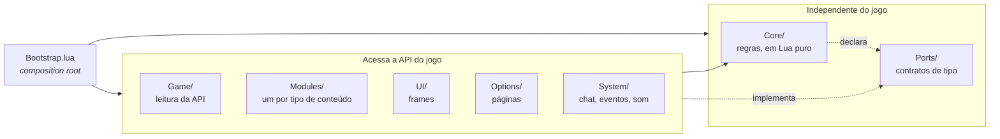
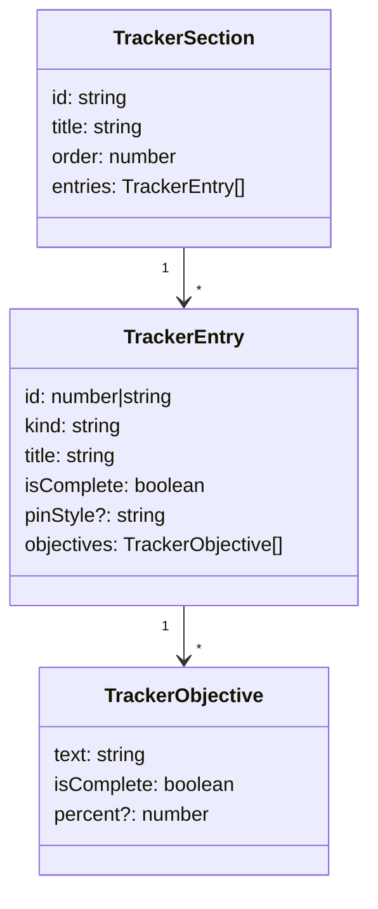

# Arquitetura

## A regra de dependência

**As dependências apontam para dentro.** O `Core/` não referencia nenhuma outra
camada; as camadas externas referenciam o `Core/`.



O `Core/` acessa recursos externos **apenas por objetos injetados**, cujo formato
está descrito em `Ports/`. Não há chamadas a `C_QuestLog`, `CreateFrame` ou
`Settings` em nenhum arquivo dele.

A restrição é verificável:

```sh
grep -rlE "C_[A-Za-z]+\.|CreateFrame|Settings\.|LibStub" Core/
```

Se o comando imprimir algum caminho, a regra foi violada.

## Motivação

**Não existe framework de teste dentro do WoW.** Código acoplado à API do jogo só
pode ser verificado abrindo o cliente e inspecionando o resultado manualmente.
Código desacoplado roda em qualquer interpretador Lua.

As ~1.400 linhas do `Core/` são cobertas por [117 testes](../Tests/Run.lua) que
rodam sem o cliente, em milissegundos, no CI.

## As pastas

| Pasta | Conteúdo | Acessa a API do jogo |
|---|---|---|
| `Core/` | filtros, ordenação, perfis, montagem das seções | **não** |
| `Ports/` | contratos de tipo, lidos pelo language server | não é código |
| `Locales/` | textos, `enUS` como padrão | só `GetLocale()` |
| `Game/` | lê a API do jogo e **não desenha nada** | sim |
| `Modules/` | um tipo de conteúdo por pasta | sim |
| `UI/` | frames | sim |
| `Options/` | páginas de opções | sim |
| `System/` | chat, comandos, eventos, som, acervo compartilhado | sim |

`Ports/` não é empacotado. São arquivos `---@meta`, sem código executável, usados
pelo language server para tipar o restante. A regra de dependência é verificada
em tempo de edição, não em execução.

## Contratos principais

Três portas concentram a maior parte do acoplamento:

**`SectionProvider`**, `Collect(): TrackerSection[]`. É o ponto de entrada de um
tipo de conteúdo no rastreador. Os 10 providers são independentes entre si.

**`TrackerRenderer`** recebe as seções montadas e as desenha. O `Core/` define
*o que* exibir; o renderer define *como*.

**`EntryActions`** define o comportamento de uma entrada ao ser clicada. O
[`EntryActionRouter`](../Modules/EntryActionRouter.lua) despacha por
`entry.kind`. Os métodos opcionais (`Describe`, `Rewards`, `SuperTrack`) são
verificados por presença antes da chamada, em vez de exigirem herança.

## Estrutura de dados comum

Cada provider traduz o formato do jogo para uma estrutura única, de modo que o
renderer trate um só formato em vez de dez:



Uma conquista, uma receita de profissão e uma missão mundial chegam ao
`EntryBlockPool` no mesmo formato. Por isso o campo `percent` passou a ser
desenhado como barra de progresso em todos os tipos de uma vez, sem alteração em
nenhum provider.

## Ordem de carregamento

O namespace é uma tabela plana (`Addon.QuestFilters`, `Addon.HexColor`), então
mover um arquivo não quebra referências. Alguns arquivos, porém, **leem outros em
escopo de arquivo**, e nesses casos a ordem no `.toc` é obrigatória:

- `Locales/` antes de tudo: o catálogo de preferências lê os rótulos ao carregar
- `Preferences/Keys`, `FontFlags`, `SortModes` e `SoundChannels` antes de
  `Preferences/Catalog`
- `Filtering/FilterIds` antes de `Filtering/Filters`

Os demais resolvem suas referências em tempo de execução e podem ser listados em
qualquer ordem.

## Decisões de projeto

**Frame próprio em vez de modificar o da Blizzard.** A abordagem anterior esbarrou
no taint: `SetScale`, `SetPoint` e `Hide` são bloqueados em frames com filho
protegido. Consumir a API de *dados* em vez do código de *interface* reduz a
exposição a mudanças entre patches, porque a primeira muda menos que a segunda.
Ver [restrições](restricoes.md).

**Preferências como dados.** Adicionar uma preferência é acrescentar uma entrada
em [`Core/Preferences/Catalog.lua`](../Core/Preferences/Catalog.lua). Nenhum
adapter muda: o painel de opções lê o catálogo e cria o controle correspondente.

**Um provider por tipo de conteúdo.** Adicionar um tipo não exige alteração em
código existente. Ver [adicionar conteúdo](adicionar-conteudo.md).
