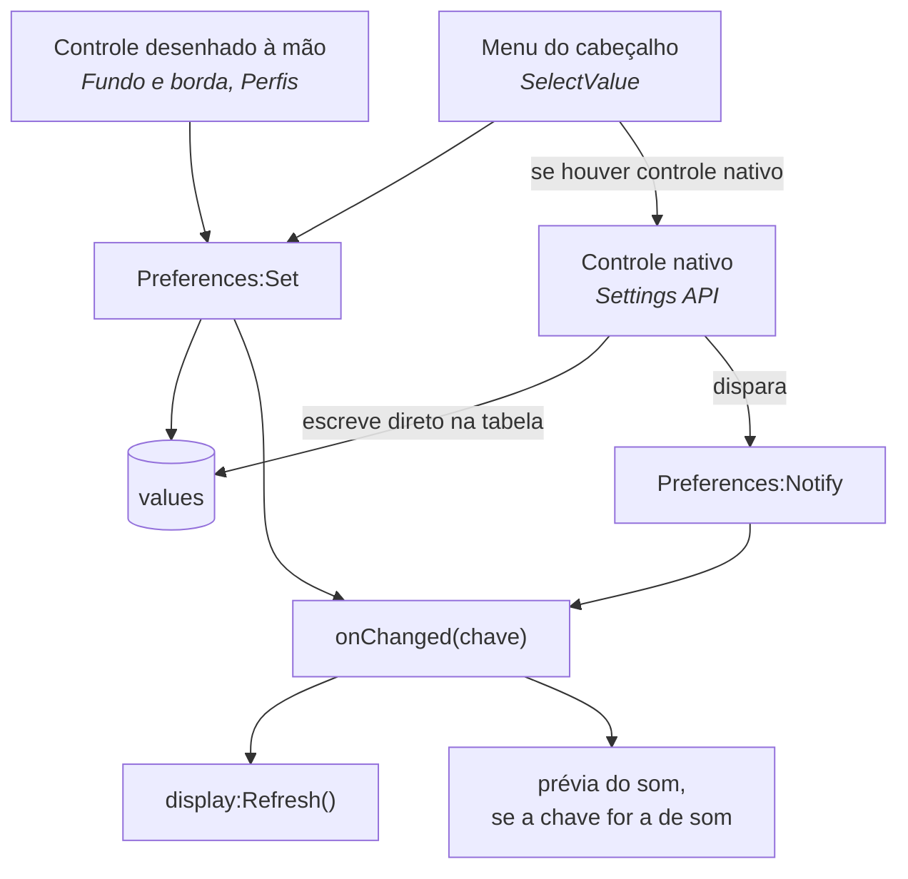
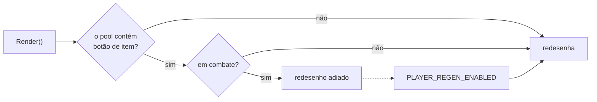

# Fluxo de execução

## Inicialização

A inicialização é dividida em duas etapas, disparadas por eventos diferentes.

```mermaid
sequenceDiagram
    participant Jogo
    participant Loader as Bootstrap
    participant Build
    participant Start

    Jogo->>Loader: ADDON_LOADED
    Note over Loader: SavedVariables disponíveis
    Loader->>Build: Build()
    Build->>Build: perfis, preferências, providers,<br/>renderer, opções, botões
    Jogo->>Loader: PLAYER_LOGIN
    Note over Loader: tela de carregamento concluída;<br/>o chat preserva as mensagens
    Loader->>Start: Start()
    Start->>Start: anexa os botões ao cabeçalho
    Start->>Start: primeiro Refresh
```

`Build()` roda em `ADDON_LOADED`, primeiro momento em que `AuraTrackerQuestorDB`
está disponível. `Start()` aguarda `PLAYER_LOGIN` porque o quadro de chat
restaura seu histórico após a tela de carregamento e descarta mensagens escritas
antes disso.

Quando o addon carrega com o jogador já logado, como num `/reload`,
`PLAYER_LOGIN` não é disparado. O loader trata esse caso verificando
`IsLoggedIn()` e chamando `Start()` imediatamente.

## Ciclo de atualização

Percurso executado a cada mudança relevante no jogo.

```mermaid
sequenceDiagram
    participant Jogo
    participant Events as TrackerEvents
    participant Boot as RefreshFromGame
    participant Display as TrackerDisplay
    participant Content as TrackerContent
    participant Providers as 10 SectionProviders
    participant Frame as OwnTrackerFrame
    participant Pool as EntryBlockPool

    Jogo->>Events: QUEST_LOG_UPDATE (em sequência)
    Events->>Events: agrupa por 0,15 s
    Events->>Boot: uma única chamada
    Boot->>Display: Refresh()
    Display->>Display: esconde o rastreador da Blizzard
    Display->>Display: aplica visibilidade dos botões
    Display->>Content: Build()
    Content->>Providers: Collect()
    Providers-->>Content: TrackerSection[]
    Content->>Content: descarta seções vazias
    Content->>Content: ordena seções por order
    Content->>Content: ordena entradas; concluídas por último
    Content-->>Display: seções montadas
    Display->>Display: aplica fonte, escala, fundo
    Display->>Frame: Render(seções visíveis)
    Frame->>Pool: Build(entrada) por linha
    Boot->>Boot: CompletionWatcher compara com o estado anterior
    Boot->>Boot: toca o som de conclusão, se habilitado
```

### Debounce

`QUEST_LOG_UPDATE` é disparado várias vezes em sequência para uma única entrega
de missão. Sem agrupamento, o rastreador seria reconstruído repetidas vezes em
frames consecutivos. O atraso de 0,15 s em
[`TrackerEvents`](../System/TrackerEvents.lua) reduz a sequência a uma única
reconstrução. Os 26 eventos registrados passam todos por esse mesmo agrupamento.

### Reaproveitamento de widgets

Cada reconstrução desenha até algumas dezenas de entradas. Como o WoW não destrói
frames, criar novos a cada atualização acumularia widgets por toda a sessão. O
[`EntryBlockPool`](../UI/Entry/BlockPool.lua) reaproveita os existentes.

## Mudança de preferência

Há um único caminho de escrita. Antes existiam dois, e apenas um deles disparava
o callback de mudança.



`Preferences:Set` não dispara o callback quando o valor recebido é igual ao
atual, então alterar um controle e voltar ao valor original não redesenha nada.

## Combate

Um botão de item de missão usa `SecureActionButtonTemplate`, o que torna
**protegidos todos os frames acima dele**. Mover, redimensionar ou esconder um
frame protegido durante o combate é bloqueado pelo jogo.



Enquanto nenhum botão de item existir, nada é bloqueado, que é o caso mais
comum. Desligar **Botões de item das missões** nas opções impede a criação de
qualquer um deles, e o rastreador passa a atualizar durante todo o combate.
