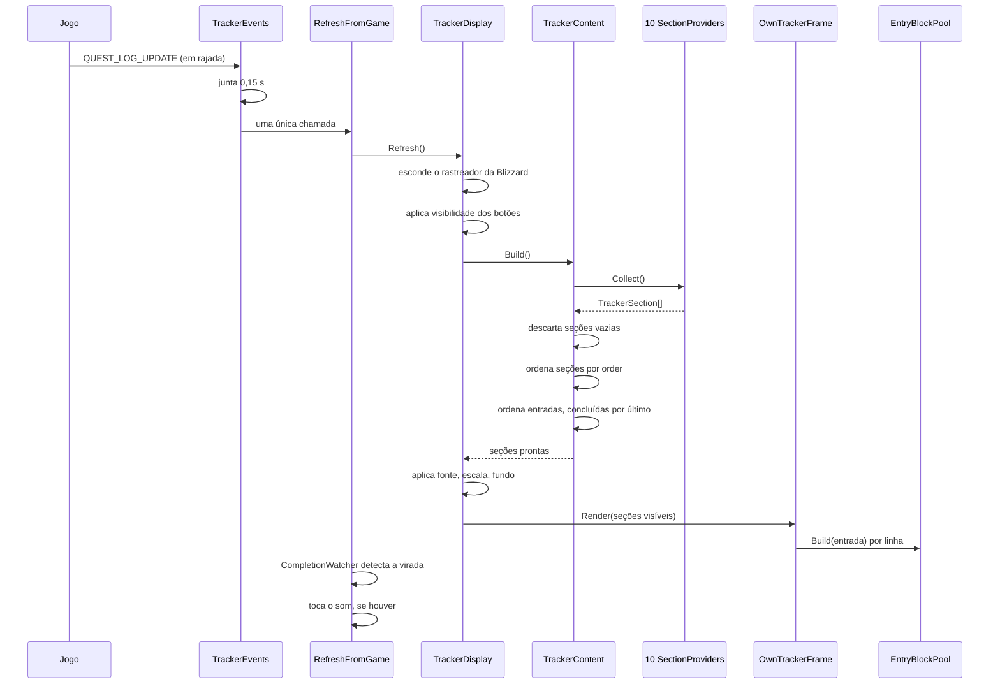
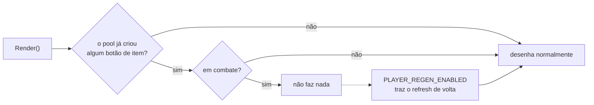

# Fluxo de execução

## Partida

O addon acorda duas vezes, e a separação é deliberada.

```mermaid
sequenceDiagram
    participant Jogo
    participant Loader as Bootstrap
    participant Build
    participant Start

    Jogo->>Loader: ADDON_LOADED
    Note over Loader: só agora as SavedVariables existem
    Loader->>Build: Build()
    Build->>Build: perfis, preferências, providers,<br/>renderer, opções, botões
    Jogo->>Loader: PLAYER_LOGIN
    Note over Loader: a tela de carregamento acabou;<br/>o chat guarda o que for escrito
    Loader->>Start: Start()
    Start->>Start: prende os botões no cabeçalho
    Start->>Start: primeiro Refresh
```

`Build()` roda em `ADDON_LOADED` porque é o primeiro momento em que
`AuraTrackerQuestorDB` existe. `Start()` espera `PLAYER_LOGIN` porque o quadro de
chat restaura o histórico depois da tela de carregamento e descarta o que foi
escrito antes: a mensagem de boas-vindas sumia.

Se o addon carregar com o jogador já logado (um `/reload`), `PLAYER_LOGIN` não
vem mais. Por isso o loader confere `IsLoggedIn()` e chama `Start()` na hora.

## O ciclo de atualização

É o caminho que roda o tempo todo.



### Por que o debounce

`QUEST_LOG_UPDATE` dispara em rajada: várias vezes para uma única entrega de
missão. Sem juntar, o rastreador seria reconstruído meia dúzia de vezes em
frames consecutivos. Os 0,15 s de
[`TrackerEvents`](../System/TrackerEvents.lua) colapsam a rajada numa
reconstrução só. São 26 eventos escutados, todos passando pelo mesmo funil.

### Por que o pool

Reconstruir a lista significa desenhar até algumas dezenas de entradas. Criar
frames a cada atualização vazaria widgets pela sessão inteira, porque o WoW não
destrói frame. O [`EntryBlockPool`](../UI/Entry/BlockPool.lua) reaproveita: não é
otimização, é requisito.

## Mudança de preferência

Existe **um** caminho, e ele foi unificado de propósito: antes havia dois, e só
um deles avisava quem precisava saber.


`Preferences:Set` cala quando o valor não mudou, então mexer num controle e
voltar ao valor original não redesenha nada.

## Combate

Um botão de item de missão é um `SecureActionButtonTemplate`, e isso torna
**protegido todo frame acima dele**. Mover, redimensionar ou esconder frame
protegido em combate é bloqueado pelo jogo.



Nada trava enquanto nenhum botão de item existir, que é o caso comum. E quem
desliga **Botões de item das missões** nas opções nunca cria nenhum, então o
rastreador atualiza durante a luta inteira.
